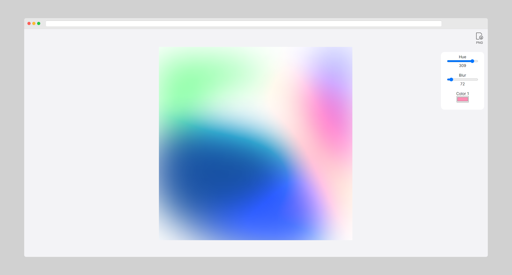

# #100DaysOfCode Log - Dean Ha
The log of my #100DaysOfCode started on January 1st, 2022

#### DAILY  LOG :

--- 

**Day 1 |  Saturday, 01 January 2022**

Happy New Year 2022!

https://codepen.io/deanha/pen/RwLMxew via @Code_

---

**Day 2 |  Sunday, 02 January 2022**

Today I’ve learned about “The Big-O Notation & Time Complexity” it’s not so easy to understand Thinking face. Would need to do more practicing and check my understanding by doing quizzes.

--- 

**Day 3 |  Monday, 03 January 2022**

Today I learnt how to integrate Google Sheets into a react app for parsing data.

I wanted to use the GSheets as a simple/temp DB, as its easy to visualise and update via the Google Sheets interface.

Good use for restaurant menus with huge list of items.

---

**Day 4 | Tuesday, 04 January 2022**

Today I've successfully completed the React & Redux course via @SoloLearn.

Now I'm excited to start building more apps with react to get familiar with the workflow.

---

**Day 5 | Wednesday, 05 January 2022**

Today I did some refactoring on my React &  Google Sheets project. I realised that the .env file isn’t so secret once you built the react app, as the secret will be compiled into the final build and are exposed.

So its best to have a backend for security.

---

**Day 6 | Thursday, 06 January 2022**

Today I build a WhatsApp bot which I had in mind for a while.

I’m plan to hook it to a Web Scraper which tracks certain data, then send real-time updates to the group chat.

Subscribers of the group can manage their own notifications in the chat settings.

**Day 7 | Friday, 07 January 2022**
Not much of a hands on coding today. Did some planning and structuring a project I have in mind instead.

We as a developer love to build things, and we often start building without a plan.

Having a plan gives a clearer outlook of the project in a whole.

---

**Day 8 | Saturday, 08 January 2022**

Today I didn’t get much done, it’s the weekend Smiling face with open mouth and cold sweat. Played around with the WhatsApp Bot a little bit more. Robot face nothing too heavy for todays coding Slightly frowning face

---

**Day 9 | Sunday, 09 January 2022**

Re-visited the JS MutationObserver today. A Web API that provides the ability to watch for changes being made to the DOM tree.

I plan to build an Extension to run on the browser and listen to changes of a real-time live chart. e.g https://tradingview.com/chart/?symbol=BINANCE%3ABTCUSDT

--- 

**Day 10 | Monday, 10 January 2022**

Day 10 | #100DaysOfCode

Today is (bit more) MutationObserver Monday

I spent a bit more time on this and got what I wanted working nicely

Then did some client work, adding a few feature to their website. 

Lastly, began restructuring my website, it needs a new design

---

**Day 11 | Tuesday, 11 January 2022**

Day 11 | #100DaysOfCode

Today I refreshed my knowledge on PHP via the 
@SoloLearn app. I find it very helpful that there is plenty of useful apps out there that allows you to learn on the go.

PHP is very easy to get started with, some really dislikes it, for me its comfort.

---

**Day 12 | Wednesday, 12 January 2022**

Started building a tool I had in mind - A Gradient Image Maker.

Sometimes we think an approach is simple in our mind until we start implementing it and realised the limitations. 

So we google it, adapt and adjust our approach, in return we learn.

---

**Day 13 | Thursday, 13 January 2022**

Just a bit of coding today, continued to build the gradient image maker. Got it saving from the DOM to PNG.

Now I need to add the functionality for custom adjustments. 

Should I design the UI first or freestyle it? Thinking face

---

**Day 14 | Friday, 14 January 2022**

Decided to create a repo for this challenge to keep track of my progress.

[https://github.com/deanha-com/100DaysOfCode](https://github.com/deanha-com/100DaysOfCode)

---

**Day 15 | Saturday, 15 January 2022**

Build a React App to parse data from the BFI REST API. 

Seems to be working well, can do with some refactoring

During this project, I found the useEffect hook very nice to use, but realized later on the console.log the API seems to be called twice. So had to look into why that is.. good practice though..

https://github.com/deanha-com/bfi-app-react

---

**Day 16 | Sunday, 16 January 2022**

Seems like a lot of people are using [@freeCodeCamp](https://www.freecodecamp.org/) for their study and learning to code. So I decided to register and refresh my knowledge from the start. Lets go 👨‍💻

Are there any other resources you use for learning to code?

---

**Day 17 | Monday, 17 January 2022**

Feel a bit burned out today, so took a long walk at the park. 🚶

We’re staring into our screens too often in this modern day.

It’s good to just take a ` `, enjoy the beauty of nature, and let your eyes focus at a different focal distance. 👀

---

**Day 18 | Tuesday, 18 January 2022**

Today I went a bit off track, was looking into TradingView and observing the charts. I stumbled upon the Pine Editor where you can write your own scripts. 

They use the Pine Script language where you can create indicators/overlays & trading strategies...

I was intrigued by this and took a dive into their docs and syntax.

- https://www.pinecoders.com/learning_pine_roadmap/
- https://www.tradingview.com/pine-script-reference/v5/

---

**Day 19 | Wednesday, 19 January 2022**

Continued with the Gradient Image Maker project today, it's coming along nicely.

Added a couple of range sliders for easy adjustments to alter the final render of the gradients using CSS filters.

[Live demo](https://kodlr.com/gradient/)

.

---

**Day 20 | Thursday, 20 January 2022**

Carried on with the gradient app, did some study on the SoloLearn and received a few challenges via the app to compete with other users (pretty addictive really). 😃

---

**Day 21 | Friday, 21 January 2022**

So today I’ve been reflecting on how I’m taking on this challenge. 

And this quote pop in mind:

“A jack of all trades is a master of none, but oftentimes better than a master of one.”

I’m definitely for “jack of all trades”..

And these are my trades in plan..

Most of these I know and have touched upon, there are some gaps that I would like to fill within this 100 Days Challenge. And some new things that I want to add to the toolbox.

Let's see how much of this we can cover in the remaining 79 days 🙂

---

**Day 22 | Saturday, 22 January 2022**

Progressed on the Gradient app today, added dark/light theme switching and a control panel for adjustments.

Did some D.R.Y refactoring, it was a productive day today. Was very much in the zone. 

I spend a bit of time tweaking the look and feel of the UI as I was freestyling it. It would probably be quicker if I designed it all in Figma first. 

Next to do is to make the individual sliders work on sliding, make it mobile-friendly, and allow exporting larger dimensions than the screen size.

---

**Day 23 | Sunday, 23 January 2022**

I've completed the MVP for the Gradient Image Maker project today. 😁

I ended up making a bunch of gradient backgrounds using this, with all the adjustment controls you can tweak the outcome to your satisfaction. 😉

Feel free to test it out and let me know if you have any feedback.👍😀

[LIVE DEMO](https://deanha.com/demo/gradient-image-maker/)

---

**Day 24 | Monday, 24 January 2022**

Progress on more reading and filling in some gaps. I came across Event Propagation - Capturing vs Bubbling

Bubbling = **Up** the DOM
Capturing = **Down** the DOM

Event propagation mode is set to "bubbling" by default.

--- 

<!-- 
**Day 25 | Tuesday, 25 January 2022**
**Day 26 | Wednesday, 26 January 2022**
**Day 27 | Thursday, 27 January 2022**
**Day 28 | Friday, 28 January 2022**
**Day 29 | Saturday, 29 January 2022**
**Day 30 | Sunday, 30 January 2022**
**Day 31 | Monday, 31 January 2022**

**Day 32 | Tuesday, 1 Feb 2022**
**Day 33 | Wednesday, 2 Feb 2022**
**Day 34 | Thursday, 3 Feb 2022**
**Day 35 | Friday, 4 Feb 2022**
**Day 36 | Saturday, 5 Feb 2022**
**Day 37 | Sunday, 6 Feb 2022**
**Day 38 | Monday, 7 Feb 2022**
**Day 39 | Tuesday,	08 February 2022**
**Day 40 | Wednesday, 09 February 2022**
**Day 41 | Thursday, 10 February 2022**
**Day 42 | Friday, 11 February 2022**
**Day 43 | Saturday, 12 February 2022**
**Day 44 | Sunday, 13 February 2022**
**Day 45 | Monday, 14 February 2022**
**Day 46 | Tuesday, 15 February 2022**
**Day 47 | Wednesday, 16 February 2022**
**Day 48 | Thursday, 17 February 2022**
**Day 49 | Friday, 18 February 2022**
**Day 50 | Saturday, 19 February 2022**
**Day 51 | Sunday, 20 February 2022**
**Day 52 | Monday, 21 February 2022**
**Day 53 | Tuesday, 22 February 2022**
**Day 54 | Wednesday, 23 February 2022**
**Day 55 | Thursday, 24 February 2022**
**Day 56 | Friday, 25 February 2022**
**Day 57 | Saturday, 26 February 2022**
**Day 58 | Sunday, 27 February 2022**
**Day 59 | Monday, 28 February 2022**

**Day 60 | Tuesday, 01 March 2022**
**Day 61 | Wednesday, 02 March 2022**
**Day 62 | Thursday, 03 March 2022**
**Day 63 | Friday, 04 March 2022**
**Day 64 | Saturday, 05 March 2022**
**Day 65 | Sunday, 06 March 2022**
**Day 66 | Monday, 07 March 2022**
**Day 67 | Tuesday, 08 March 2022**
**Day 68 | Wednesday, 09 March 2022**
**Day 69 | Thursday, 10 March 2022**
**Day 70 | Friday, 11 March 2022**
**Day 71 | Saturday, 12 March 2022**
**Day 72 | Sunday, 13 March 2022**
**Day 73 | Monday, 14 March 2022**
**Day 74 | Tuesday, 15 March 2022**
**Day 75 | Wednesday, 16 March 2022**
**Day 76 | Thursday, 17 March 2022**
**Day 77 | Friday, 18 March 2022**
**Day 78 | Saturday, 19 March 2022**
**Day 79 | Sunday, 20 March 2022**
**Day 80 | Monday, 21 March 2022**
**Day 81 | Tuesday, 22 March 2022**
**Day 82 | Wednesday, 23 March 2022**
**Day 83 | Thursday, 24 March 2022**
**Day 84 | Friday, 25 March 2022**
**Day 85 | Saturday, 26 March 2022**
**Day 86 | Sunday, 27 March 2022**
**Day 87 | Monday, 28 March 2022**
**Day 88 | Tuesday, 29 March 2022**
**Day 89 | Wednesday, 30 March 2022**
**Day 90 | Thursday, 31 March 2022**

**Day 91 | Friday, 01 April 2022**
**Day 92 | Saturday, 02 April 2022**
**Day 93 | Sunday, 03 April 2022**
**Day 94 | Monday, 04 April 2022**
**Day 95 | Tuesday, 05 April 2022**
**Day 96 | Wednesday, 06 April 2022**
**Day 97 | Thursday, 07 April 2022**
**Day 98 | Friday, 08 April 2022**
**Day 99 | Saturday, 09 April 2022**
**Day 100 | Sunday, 10 April 2022**

-->